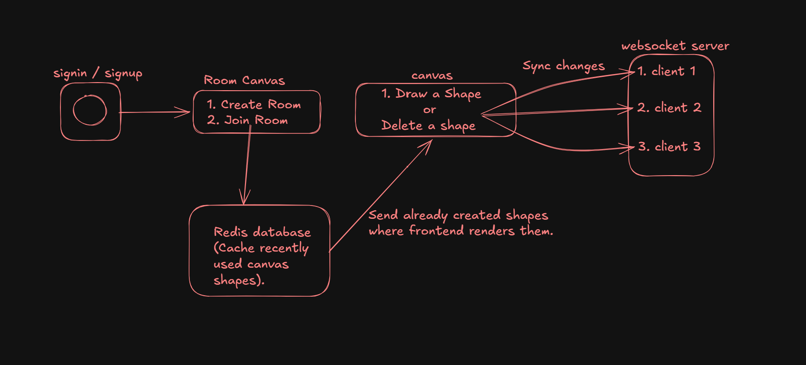

#  Excalidraw Clone
Deployed link -> https://excalidraw-excalidraw-frontend-theta.vercel.app/

##  How to Run  

1. Clone the repository  
2. Add your **Database URL** and **Redis URL** in the `.env` files for both:
   - `http-backend`
   - `ws-backend`  
3. Install dependencies:  ``` pnpm install ```
4. Start the development servers:
``` pnpm run dev```

## Features (added with love❤️)

1. Draw shapes like rectangle, square, circle, arrows, and freehand sketches

2. Real-time collaboration using WebSockets, Open the app in multiple tabs and changes sync instantly across all sessions.

4. Infinite canvas support

5. Smooth panning, zoom in, and zoom out

6. Multiple color support (Customize your drawings with different colors)

## Tech Stack
NextJs, Node JS, Websockets, Redis and Prisma ORM 

## Architecture


